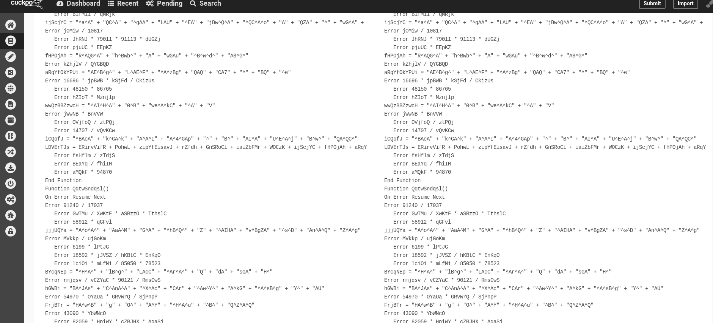
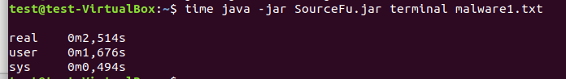
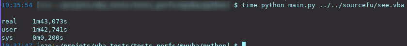

Introduction
************

About
=======
For source code intellectual property or to evade antivirus signatures, more and more programs get obfuscated from the source code. Famous legal examples are Facebook app on android or Dropbox client(in python). SourceFu is a tool that triestrying to provide a generic source to source deobfuscator, for malware analysts, reversers or simply curious people. Why generic? First, because SourceFu aims at providing support for multiple languages obfuscation. Second because deobfuscation methods employed should be adaptable to every language.

The documentation tries to cover the whole project :

- In this page, the genesis of the project, as well as a little insight of SourceFu features and limitations will be presented. A bit more in-depth analysis of why SourceFu could be interesting is presented :doc:`there</some state of the art>`
- A quickstart guide is presented :doc:`there </quickstart>`
- A complete user manual is given :doc:`there </user manual>`
- the whole methodology used by the tool is then explained :doc:`here </functioning>`.
- Current ideas to improve SourceFu are presented :doc:`here </planned features>`
- Wanna contribute? please see the :doc:`contributing guide </contributing guide>` as well as the :doc:`development guide </development guide>` (those sections still need to be done). 

SourceFu overview
=================

genesis of the project
----------------------

I was once asked at work to evaluate Cuckoo Sandbox project, especially to determine if the latter's analyses are correct or not. In my tests, i used some handmade scripts that I obfuscated using the `invoke-obfuscation framework <https://https://github.com/danielbohannon/Invoke-Obfuscation>`_ made by Daniel Bohannon. Especially, a first observation leaded to the fact that Cuckoo sandbox is not able to deobfuscate properly scripts :

Later on, while still assessing some tests on Cuckoo, a misplaced 'rm -r' leaded to the erasure of my original powershell scripts but not the obfuscated ones. In order to retrieve them (bad forensic guy, yeah i know), i planned so to deobfuscate the scripts that i still have. And there, the FU came! There was no deobfuscator for powershell, and i had to do the whole shit by hand....

.. image:: imgs/rage.jpg
   :scale: 20%
   :align: center

From there, i first started to work on a simple pattern matching powershell deobfuscator, which to be honest was kind of bad : some regex should be matched if we are outside strings, but not inside; a powershel's "replace" should work only on the string to be replaced and not on a variable name, etc... The regex became so more and more complex while i was developing it, and the whole thing was a harsh to maintain.

I decided so to move on another approach : why not use a grammar and a parser? More, what if i want to evaluate expressions in order to provide a more complete deobfuscation?

From those questions emerged the SourceFu project... whose name is composed of "source", because only source obfuscation techniques are treated by the tool, and "Fu" because of my rage when i needed to deobfuscate those powershell scripts.

What is this really about so?
-----------------------------
*this section is still under construction*

..
  Let's take here is a sample taken from the "Obfuscated Empire" framework, that i don't want to deobfuscate by hand because i'm too lazy.

  The code taken from "Obfuscated Empire" is stored within "myobf1.ps1" and  
  **TBD**

  We will use here SourceFu to provide us a deobfuscation pass:
  **TBD**
 
  Here is the result :
  **TBD**

Wait, so you're using java?
---------------------------

Hell yeah. I started the projet by doing everythin in python, because i love this language. However, antlr runtime is really slow in python, and i don't know why. For example, let's take the following script gathered on the net :

To simply parse this script (and only parse it) in python given the used grammar in SourceFu, i need :

Also, i did not want to code the whole thing in languages such as C/C++, because SourceFu basically manipulates strings, and strings management in C is quite a nightmare. By the way, i was not able to make functioning programs using C++ runtime of antlr, as outputs from antlr do not compile.

So, the original language used by antlr (and normally fully supported), java, was chosen, even if i hate it. For the comparison, here is the time needed to parse the same script i parsed with python, while still initializing the whole JVM and while in a VM :

Features
--------
For now, SourceFu provides a command line interface permitting to run some deobfuscation routines on a VBA script. Unfortunately, this kind of tool is hard to code, and features are still not extensive. A complete list of what to expect is presented :doc:`there</functioning>`. 

Limitations
-----------

Deobfuscation is a NP-complete problem. In "understandable" words, you won't be able to retrieve the original script for sure.

Indeed, let's say you have "var4" as a variable name within a script, which is then obfuscated to "AzsXX1LiOo0pm". It's impossible to determine actually if the original name was actually "var4" instead of "var1". Retrieving comments are not possible too.
